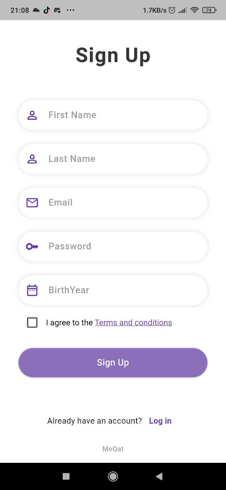
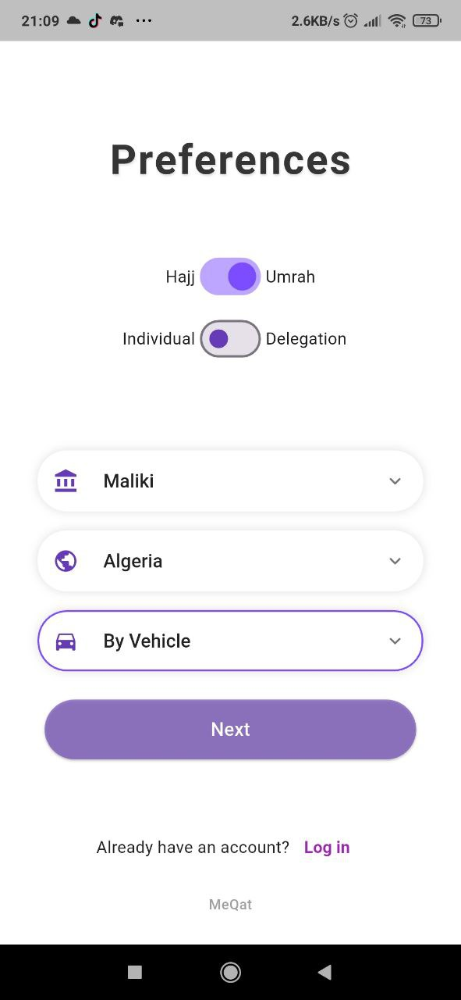
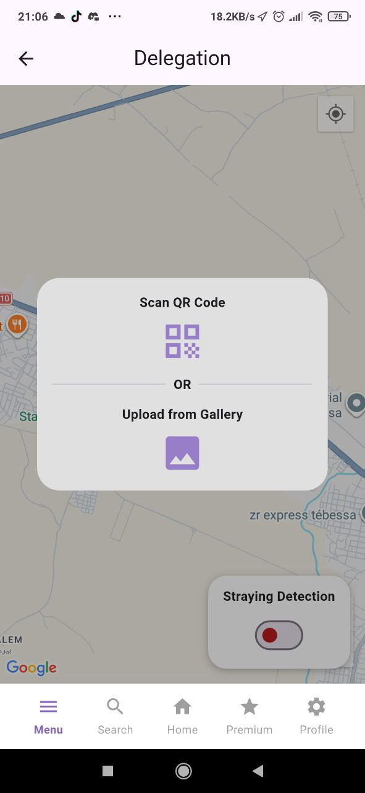

  

<h1 align="center">🕋 MeQat</h1>

  <b>Smart Hajj & Umrah Assistant</b> 
  Multi-Platform • Multi-Language • Madhhab-Inclusive • AI-Powered

MeQat – Hajj & Umrah Assistant App

MeQat is a multi-platform, multi-language mobile application designed to assist pilgrims performing Hajj and Umrah. It combines real-time guidance, health monitoring, delegation tracking, and smart assistance to simplify the pilgrimage experience for users of all ages and technical abilities.

🌟 Features

Medication Reminders

Automatically reminds users to take their medications based on schedules.

Real-Time GPS Tracking

Tracks users and linked delegation members to prevent anyone from getting lost.

Delegation leaders can see all members’ locations.

Lost Member Assistance

Uses face recognition to identify lost members and their delegation.

Quickly reconnects them with the group.

Health Monitoring

Detects potential health issues based on user movement, medication history, and age.

Sends alerts and contacts help if the user does not respond.

Step-by-Step Ritual Guidance

Guides pilgrims through all Hajj and Umrah rituals.

Notifies users if they can enter Ihram based on Miqat alignment, calculated via GPS and earth geometry.

Accommodation & Dining Options

Displays hotels, restaurants, and price ranges.

Ensures pilgrims have choices and avoid overpaying.

Smart Vocal Assistant

Users can interact via voice for hands-free guidance.

🎯 Why MeQat?

Unique to Algeria: Unlike Saudi apps, MeQat serves users in Algeria and beyond.

Inclusive Fiqh Support: Supports all four Madhhabs and shows respective rulings instead of forcing one interpretation.

Elder-Friendly: Optimized for smartwatches and simple notifications for users unfamiliar with technology.

Choice-Oriented: Offers flexible options for Ihram, hotels, and restaurants.

Multi-Platform: Works on Android, iOS, tablets, and can be used internationally.

Multi-Language Support: Designed for international pilgrims to feel at home.

🛠 Technology Stack

Frontend: Flutter (Dart)

IDE: Android Studio

Backend / Cloud:

Firebase: Data storage and authentication

Supabase: Image storage and metadata after processing

AI / Face Recognition:

Custom FaceNet (InceptionResNetV1) model implemented in Python (Kaggle, Torch, facenet-pytorch)

Achieved 98.65% verification accuracy on LFW dataset

📂 Dependencies

flutter, google_maps_flutter, geolocator, firebase_core, cloud_firestore, firebase_auth

speech_to_text, flutter_tts

tflite_flutter, google_mlkit_face_detection

supabase_flutter, hive, hive_flutter

local_auth, audioplayers, qr_flutter, mobile_scanner, image_picker

intl, url_launcher, adhan, flutter_localizations, smooth_page_indicator

(See full pubspec.yaml for complete list)

📷 Screenshots

You can add your screenshots here like this:

🎥 Demo Video

Watch the app in action on YouTube: Demo Link

⚙️ Setup Instructions

Clone the repository:

git clone https://github.com/yourusername/MeQat.git
cd MeQat

Install Flutter dependencies:

flutter pub get

Connect Firebase and Supabase with your own credentials.

Run the app:

flutter run

📝 Notes

Designed for multi-platform usage: Android, iOS, and smartwatches.

Supports multi-language (Arabic, English, and others).

Ensures users do not have to walk extra miles to perform rituals, unless desired.

Bridges technology with religious guidance, giving pilgrims freedom, safety, and convenience.

📜 License

This project is proprietary, currently under development.

# 🎥 Demo

▶ [[YouTube Demo Link Here](https://youtu.be/_lfL5pdKrwA?si=75G-z0fPZZa66BRu)]

---

# 📸 Screenshots

Add screenshots here:

| SignUp | Preferences | Home |
|------|-------|------|
|  |  |  |

| Medicine | Delegation | Menu |
|------|-------|------|
|  |  |  |
