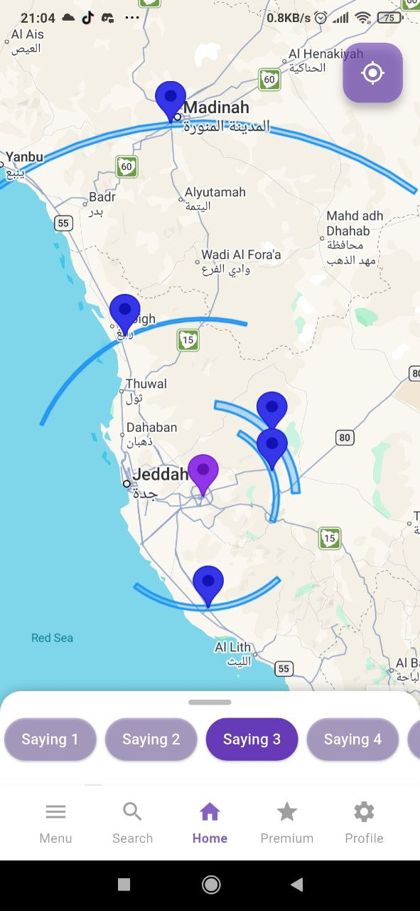
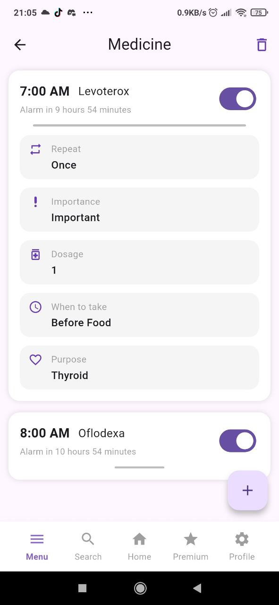
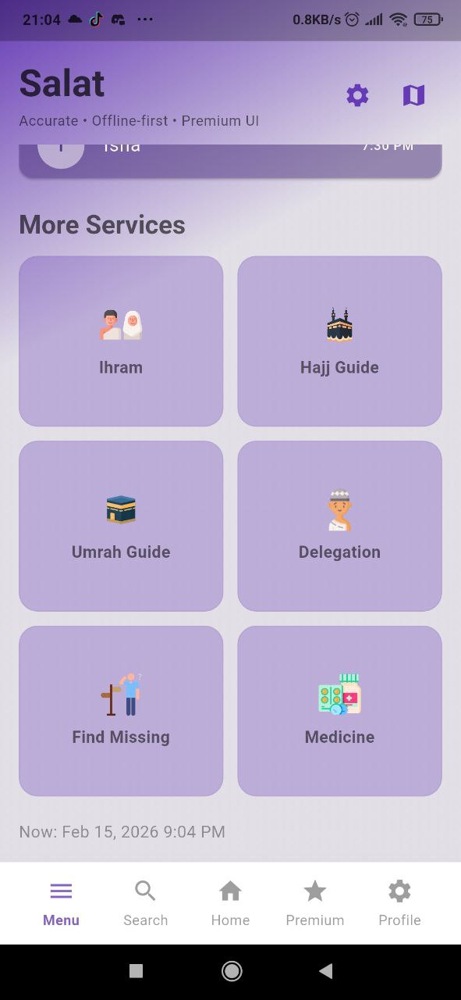

  

<h1 align="center">🕋 MeQat</h1>

  <b>Smart Hajj & Umrah Assistant</b> 
  Multi-Platform • Multi-Language • Madhhab-Inclusive • AI-Powered

---

## 🚀 About MeQat

**MeQat** is a next-generation pilgrimage assistant designed to modernize Hajj & Umrah guidance through AI, geospatial computation, health monitoring, and delegation safety systems.

It transforms traditional fiqh theory into real-time digital execution.

---

## 🌍 Why MeQat?

✔ No comprehensive Algerian Hajj assistant  
✔ Supports **Hanafi • Maliki • Shafi’i • Hanbali**  
✔ Smartwatch support for elderly pilgrims  
✔ Real Miqat alignment detection (GPS + Earth math)  
✔ AI Face Recognition (98.65% verified accuracy)  
✔ Health anomaly detection  
✔ Transparent hotels & restaurant pricing  
✔ Voice AI assistant

---

# 🧠 Core Features

## 🩺 1. Smart Medication & Health Monitoring

- Scheduled medication reminders
- Activity monitoring
- Age & medical-aware risk detection
- Emergency alert protocol

---

## 📍 2. Delegation GPS Tracking

- Real-time location monitoring
- Prevent lost pilgrims
- Map visualization via Google Maps

---

## 👤 3. AI Lost Person Re-Identification

If a pilgrim is lost:

1. Capture face
2. Detect face (ML Kit)
3. Generate embedding (FaceNet)
4. Compare embeddings
5. Identify delegation
6. Reconnect safely

### 🔬 AI Performance

| Metric | Result |
|--------|--------|
| Dataset | LFW |
| Model | InceptionResnetV1 |
| Accuracy | **98.65%** |
| Optimal Threshold | 0.4558 |

---

## 🗺 4. Real Miqat Alignment System (Unique Feature)

Instead of forcing pilgrims to visit the physical mosque:

- GPS tracking
- Geodesic calculations
- Earth curvature math
- Alignment detection

Users are notified when reaching Miqat alignment and may enter Ihram directly.

Supports pilgrimage routes to:
- Mecca
- Medina

---

## 🕌 5. Step-by-Step Ritual Guidance

- Ihram
- Tawaf
- Sa’i
- Arafah
- Jamarat
- Qurbani
- Completion

Includes comparative fiqh across all four madhhabs.

---

## 🏨 6. Hotels & Restaurants Transparency

- Nearby hotels
- Price ranges
- Restaurant options
- Prevent overcharging

---

## 🎙 7. Smart Voice Assistant

- Speech-to-Text
- Text-to-Speech
- Multilingual
- Interactive ritual support

---

# 🛠 Technology Stack

### 📱 Frontend
- Flutter (Dart)
- Android Studio
- JDK

### ☁ Backend
- Firebase Core
- Cloud Firestore
- Supabase

### 🤖 AI / ML
- Google ML Kit
- TFLite
- Custom FaceNet Model (PyTorch)
- Kaggle training environment

---

# 📦 Key Dependencies

- google_maps_flutter
- geolocator
- google_mlkit_face_detection
- tflite_flutter
- speech_to_text
- flutter_tts
- firebase_core
- cloud_firestore
- supabase_flutter

---

# 🎥 Demo

▶ [[YouTube Demo Link Here](https://youtu.be/_lfL5pdKrwA?si=75G-z0fPZZa66BRu)]

---

# 📸 Screenshots

Add screenshots here:

